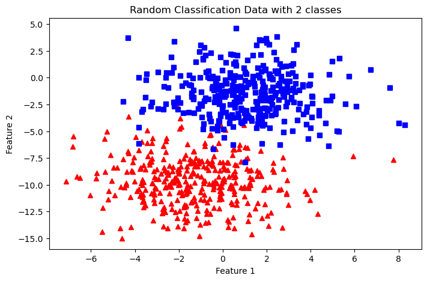

# perceptron-demo
### Overview 

The Perceptron algorithm is a supervised learning algorithm used for binary classification tasks. This implementation trains a Perceptron model on input data (X) with corresponding labels (y) and returns the learned parameters, along with details of the training process.

### Code Explanation

Import necessary packages

```python
import numpy as np
import pandas as pd
import matplotlib.pyplot as plt
from sklearn import datasets
```

Create dataset of 700 datapoints with standard deviation of 2.2 and having 2 classes

```python
X,y=datasets.make_blobs(n_samples=700,
                        n_features=2,
                        centers=2,
                        cluster_std=2.2,
                        random_state=2)
```

Plot the dataset

```python
fig=plt.figure(figsize=(8,5))
plt.plot(X[:,0][y==0],X[:,1][y==0],'r^')
plt.plot(X[:,0][y==1],X[:,1][y==1],'bs')
plt.xlabel("Feature 1")
plt.ylabel("Feature 2")
plt.title("Random Classification Data with 2 classes")
```



Create a step function

```python
def step_func(z):
    return 1.0 if (z>0) else 0.0
```

Algorithm:


```python
def perceptron(X,y,lr,epochs):
    # X --> Inputs.
    # y --> labels/target.
    # lr --> learning rate.
    # epochs --> Number of iterations.
    
    # m-> number of training examples
    # n-> number of features
    
    m,n=X.shape
    
    # Initializing parapeters(theta) to zeros.
    # +1 in n+1 for the bias term.
    theta=np.zeros((n+1,1))
    # print("theta is : ",theta)
    # Empty list to store how many examples were
    # misclassified at every iteration.
    n_miss_list=[]
    theta_list=[]
    
    #Training
    for epoch in range(epochs):
        #variable to store miss-classified
        n_miss=0
        #looping for every exmaple
        for idx,x_i in enumerate(X):
            # print(idx,x_i)
            x_i=np.insert(x_i,0,1).reshape(-1,1)
            # print(x_i)
            #calculating prediction/hypothesis
            y_hat=step_func(np.dot(x_i.T,theta))
            # print("x_i transpose and theta ",x_i.T,theta)
            # print(np.dot(x_i.T,theta))
            #updating if the example is missclassified
            #if (np.squeeze(y_hat)-y[idx])!=0
            # print(y_hat)
            if(y_hat-y[idx])!=0:
                theta += lr*((y[idx]-y_hat)*x_i)
                
                #Incrementing by 1
                n_miss+=1
            
            #appending no of missclassified examples 
            #at every iteration
            
        n_miss_list.append(n_miss)
        theta_list.append(theta)
            
            
    return theta,n_miss_list,theta_list
        
```
Inputs:

- X: Feature matrix of shape (m, n), where m is the number of examples, and n is the number of features.
- y: Target labels, where each label corresponds to an example in X.
- lr: Learning rate, controlling the size of parameter updates.
- epochs: Number of iterations for training.

Output:

- theta: Learned model parameters.
- n_miss_list: Number of misclassified examples at each epoch.
- theta_list: Parameter values after each epoch.

```python
m, n = X.shape
theta = np.zeros((n + 1, 1))
n_miss_list = []
theta_list = []
```
The weight vector theta is initialized to zeros. It has a size of (n + 1) to account for the bias term.
- n_miss_list: Tracks the number of misclassified examples in each epoch.
- theta_list: Stores the values of the parameter vector after every epoch.

Training 

```python
for epoch in range(epochs):
    n_miss = 0

```
The outer loop runs for the specified number of epochs.
n_miss is initialized to count the number of misclassified examples in the current epoch.

Updating weights

```python
for idx, x_i in enumerate(X):
    x_i = np.insert(x_i, 0, 1).reshape(-1, 1)  # Add bias term to input
    y_hat = step_func(np.dot(x_i.T, theta))  # Compute prediction

```

- Each input feature vector x_i is augmented with a bias term (value 1) at the start.
- The prediction y_hat is computed as the result of a step function applied to the dot product of x_i and theta.

```python
if (y_hat - y[idx]) != 0:
    theta += lr * ((y[idx] - y_hat) * x_i)  # Update weights
    n_miss += 1

```

- If the prediction y_hat does not match the true label y[idx], the weights are updated using the Perceptron update rule:
  θ=θ+lr⋅(y[i]− yhat )⋅xi

- The count of misclassified examples (n_miss) is incremented.

​Tracking training progress

```python
n_miss_list.append(n_miss)
theta_list.append(theta)
```

- After each epoch, the number of misclassified examples is stored in n_miss_list.
- The updated parameter vector theta is stored in theta_list
 
Return values 

```python
return theta, n_miss_list, theta_list
```
The function returns:
- Final Weights (theta): The learned model parameters after training.
- Misclassification History (n_miss_list): A list of misclassified examples across epochs, useful for visualizing training progress.
- Weight History (theta_list): The parameter updates for each epoch.


